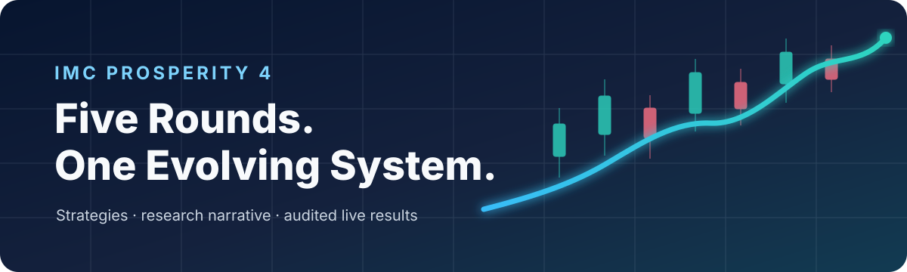
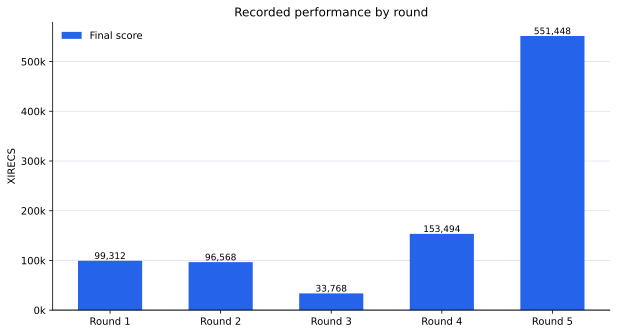
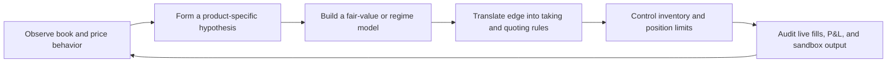

<p align="center">
  
</p>

# IMC Prosperity 4 — strategy and research archive

This repository tells the story of how my trading system evolved across all five rounds of IMC Prosperity 4. It contains the exact executable logic from each submitted strategy, cleaned of comments and docstrings, together with an evidence-based explanation of what I observed, what I believed, why I chose each model, how I expressed it in orders, and what the live results taught me.

The useful story is the progression: a product-specific model in Round 1, richer microstructure in Round 2, derivatives and portfolio risk in Round 3, flow-aware valuation in Round 4, and a family-based system for 50 products in Round 5.

> Results below come directly from the supplied submission exports. Inferred research intent is labeled as a working hypothesis; measured outcomes come from the capsules.

## Results at a glance

| Round | Products | Final score | Main idea |
|---:|---:|---:|---|
| [1](rounds/round-01/README.md) | 2 | 99,311.53 | Bot-level fair value + directional carry |
| [2](rounds/round-02/README.md) | 2 | **96,567.54** | Microstructure, trend regression, and inventory-aware execution |
| [3](rounds/round-03/README.md) | 12 | 33,767.52 | Mean reversion + calibrated voucher fair values |
| [4](rounds/round-04/README.md) | 12 | 153,493.93 | Stable midpoints, counterparty flow, and volatility filtering |
| [5](rounds/round-05/README.md) | 50 | 551,448.35 | Product-family engines and opening-regime signals |
| **Capsule-derived total** |  | **934,588.86** |  |



Every score uses the final `profit` value recorded by its result export.

The complete capsule audit, score paths, product-level results, fill counts, and validation details are in [docs/results.md](docs/results.md).

## How I approached the competition

My process can be reconstructed as a repeated research loop:



Three ideas recur throughout the code:

1. **Fair value depends on market structure.** I used characteristic liquidity levels for Osmium, a trend model for Pepper Root, slow anchors for mean-reverting products, wall midpoints for noisy vouchers, and opening-regime signals when the final round became cross-sectional.
2. **A signal is not yet a strategy.** Every model needed an execution layer: when to cross the spread, when to join or improve, how much size to expose, and how inventory should move the quote.
3. **A model earns its place through execution.** I connected every signal to actual fills, inventory, and capsule P&L instead of evaluating it only as a price forecast.

The evidence standard and the distinction between measured behavior and inferred intent are explained in [docs/methodology.md](docs/methodology.md).

## Tools and infrastructure

I used [Jmerle's Prosperity 3 backtester](https://github.com/jmerle/imc-prosperity-3-backtester) and [visualizer](https://github.com/jmerle/imc-prosperity-3-visualizer) during research. They gave me a much faster loop than repeatedly waiting on the hosted tester:

| Tool | How I used it |
|---|---|
| Backtester | Replay historical price/trade days, compare product P&L, test parameters, and validate position and execution behavior before submission |
| Visualizer | Inspect price paths, order-book behavior, positions, fills, and P&L so a numerical result could be connected back to market behavior |

The workflow was deliberately iterative: use exploratory analysis to form a hypothesis, express it in `Trader`, run it across the available days, inspect the behavior visually, and then submit once the model and execution agreed. I treated local results as a research filter because a replay cannot reproduce every live bot, queue, fill, or market-impact effect.

These upstream tools are acknowledged here rather than copied into this repository. Their licenses and setup instructions remain in their respective projects.

## Strategy evolution

| Research question | Round 1 | Round 2 | Round 3 | Round 4 | Round 5 |
|---|---|---|---|---|---|
| Fair value | Bot signatures / linear path | EMA, microprice, OBI, rolling trend | OU anchors, wall mid, linear delta | Stable mid, flow-adjusted EMA, IV surface | Family-specific microprice, trends, opening regimes |
| Execution | Take, clear, join/improve | Multi-level sweeps, ladders, scored quotes | Deviation-scaled trades and passive options | Zone targeting plus filtered voucher trades | Layered active targets and passive family engines |
| Inventory | Threshold quote skew | Reservation price and target-position penalty | Per-product caps and portfolio delta hedge | Aggressive-inventory tracking and zones | Soft targets, stop states, EOD flattening, final limiter |
| Main lesson | Separate product behavior | Make execution adapt to state | Coordinate portfolio exposure | Cleaner signals improved consistency | Modular design makes breadth manageable |

## Round-by-round research story

### Round 1 — two products, two different models

I treated Ash Coated Osmium as a microstructure-driven mean-reverter and Intarian Pepper Root as a directional carry product. The split was productive: Pepper Root contributed almost 80% of the round's 99,311.53 XIRECS. [Read the Round 1 narrative →](rounds/round-01/README.md)

### Round 2 — richer microstructure and adaptive execution

I made Osmium more adaptive and gave Pepper Root a rolling linear trend, imbalance adjustment, dip sweeping, and passive quote scoring. The combined system finished with a positive score of 96,567.54 XIRECS. [Read the Round 2 narrative →](rounds/round-02/README.md)

### Round 3 — from spot products to a voucher portfolio

The problem expanded to 12 products. I combined slow mean reversion in the underlyings with wall-mid execution, locally linear voucher fair values, parity logic, and a portfolio delta hedge. [Read the Round 3 narrative →](rounds/round-03/README.md)

### Round 4 — make fair value less noisy and more informed

I moved Hydrogel to an outer-book stable midpoint, tracked aggressive inventory separately from passive market making, used selected counterparty flow to shift the underlying center, and filtered voucher trades against an implied-volatility surface. P&L rose to 153,493.93 XIRECS. [Read the Round 4 narrative →](rounds/round-04/README.md)

### Round 5 — scale by product family

With 50 active products, I organized the market into separate engines for Translators, UV Visors, Sleep Pods, Galaxy Sounds, Microchips, Snackpacks, Pebbles, Robots, Panels, and Oxygen Shakes, then added shared stop, market-making, and EOD layers. Oxygen Shake Chocolate became the standout contributor to a 551,448.35 result. [Read the Round 5 narrative →](rounds/round-05/README.md)

## Repository layout

```text
.
├── README.md
├── docs/
│   ├── assets/                 # Generated, sanitized result figures
│   ├── data.md                 # Capsule provenance and data policy
│   ├── methodology.md          # How the research narrative was reconstructed
│   └── results.md              # Full audited results and product attribution
├── rounds/
│   ├── round-01/ ... round-05/
│   │   ├── README.md           # Observation → hypothesis → implementation → lesson
│   │   ├── trader.py           # Comment-free historical strategy
│   │   ├── summary.json        # Sanitized capsule metrics and checksums
│   │   └── capsule/README.md   # Why raw exports remain local-only
├── scripts/
│   ├── clean_sources.py        # Comment/docstring removal with AST checks
│   ├── analyze_round_one.py     # Deep Round 1 capsule analysis and replay
│   ├── summarize_capsules.py   # Local raw export → sanitized summary
│   ├── generate_figures.py     # Summary/capsule → SVG figures
│   ├── generate_results_doc.py # Summary → detailed results report
│   └── verify_repository.py    # Syntax, comment, and summary checks
└── requirements-docs.txt
```

## Reproducing the checks

Python 3.10 or newer is required. The strategies themselves use only the standard library plus the competition-provided `datamodel`; Rounds 1–4 are not standalone programs without that module.

```bash
python -m compileall -q rounds scripts
python scripts/clean_sources.py --check rounds/round-*/trader.py
python scripts/verify_repository.py
python scripts/analyze_round_one.py
```

If the local raw exports are present in each `capsule/` directory, the summaries and figures can also be regenerated:

```bash
python scripts/summarize_capsules.py
python scripts/generate_results_doc.py
python -m pip install -r requirements-docs.txt
python scripts/generate_figures.py
```

## Data and reproducibility

The supplied ZIPs are submission-result exports, not the organizer's historical price/trade data capsules. Their raw JSON/log files contain submission UUIDs and organizer data, so they remain intact on the local machine but are ignored by Git. The repository publishes only the user's cleaned strategies and sanitized aggregates. See [docs/data.md](docs/data.md) for the distinction, pinned public references, and usage cautions.

No license is granted for the strategy code in this archive.

## FAQ

### How was the source cleaned?

The submitted files contained hundreds of experiment notes, internal run IDs, and superseded explanations. I moved the durable reasoning into evidence-backed round documents and kept the code as a clean historical snapshot. The cleanup was verified against the original executable syntax tree and differential snapshots.

### Is the strategy code archival or rewritten?

It is archival. The executable behavior is preserved so the code, capsule metrics, and round narratives describe the same historical submissions. Future strategy iterations can be developed separately without changing that record.

### Where are the raw capsules stored?

They contain identifiers and competition data, duplicate tens of megabytes internally, and may be subject to organizer redistribution restrictions. Each tracked `summary.json` contains the safe aggregates and SHA-256 fingerprints needed to reconnect it to the local raw files.

### Can these files be submitted directly?

They are historical artifacts, not submission-ready packages. The platform supplies `datamodel`, and formatting increased the size of some files. Use the original competition environment and validate source-size limits before any reuse.
