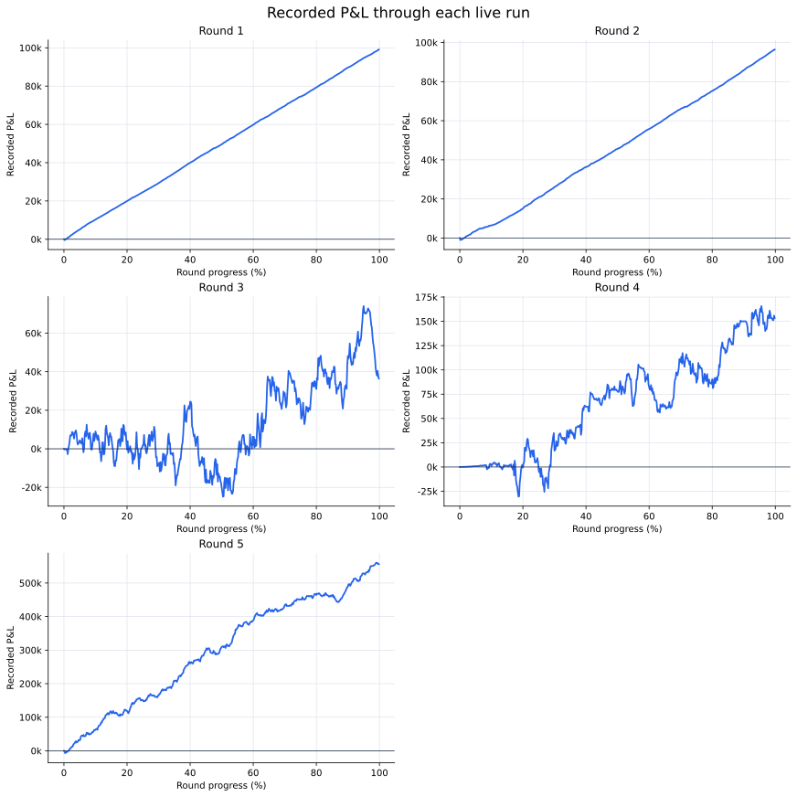
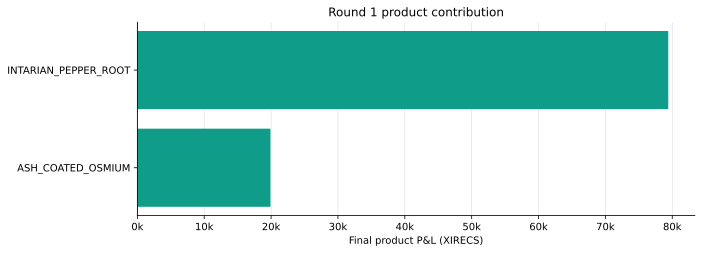
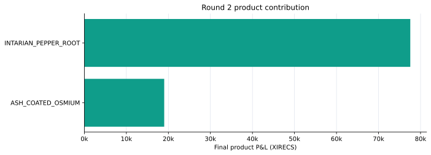
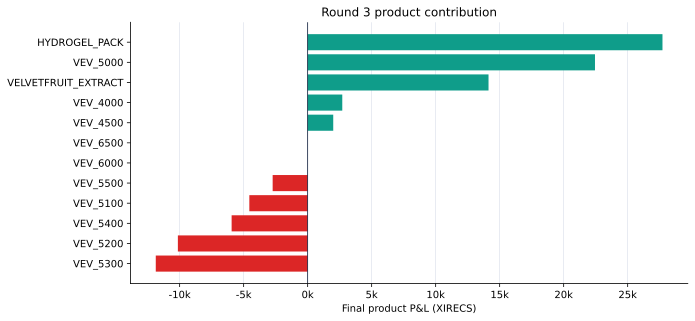

# Results and capsule validation

This report is generated from the sanitized `summary.json` file in each round. The local raw submission exports were used to build those summaries, but are deliberately excluded from Git.

## Overall results

| Round | Status | Final score | Products | Fills | Filled units |
|---:|---|---:|---:|---:|---:|
| 1 | FINISHED | 99,311.53 | 2 | 728 | 4,237 |
| 2 | FINISHED | 96,567.54 | 2 | 1,175 | 6,321 |
| 3 | FINISHED | 33,767.52 | 12 | 4,026 | 25,817 |
| 4 | FINISHED | 153,493.93 | 12 | 3,852 | 42,893 |
| 5 | FINISHED | 551,448.35 | 50 | 8,810 | 33,181 |
| **Total** |  | **934,588.86** |  | **18,591** | **112,449** |

Each final score is the `profit` value recorded in the supplied result export.

## P&L progression

The exported graph stops at timestamp 998,000, while the reported final result uses timestamp 999,900.

| Round | 0 | 250k | 500k | 750k | 998k | Reported final |
|---:|---:|---:|---:|---:|---:|---:|
| 1 | 0.00 | 24,625.19 | 49,581.22 | 74,498.53 | 99,097.18 | 99,311.53 |
| 2 | 0.00 | 20,872.56 | 45,633.06 | 70,091.53 | 96,410.09 | 96,567.54 |
| 3 | 0.00 | 1,890.50 | -20,231.62 | 22,274.81 | 36,400.20 | 33,767.52 |
| 4 | 0.00 | -3,594.99 | 78,083.86 | 86,825.39 | 153,369.96 | 153,493.93 |
| 5 | 0.00 | 151,327.10 | 309,792.36 | 451,420.54 | 556,358.93 | 551,448.35 |

## Product-level contribution

A fill event is one trade-history record where the submission is the buyer or seller. Ending positions were checked against signed fill quantities.

### Round 1

| Product | Final P&L | End position | Fill events | Buy units | Sell units |
|---|---:|---:|---:|---:|---:|
| `ASH_COATED_OSMIUM` | 19,908.53 | 5 | 720 | 2,081 | 2,076 |
| `INTARIAN_PEPPER_ROOT` | 79,403.00 | 80 | 8 | 80 | 0 |

### Round 2

| Product | Final P&L | End position | Fill events | Buy units | Sell units |
|---|---:|---:|---:|---:|---:|
| `ASH_COATED_OSMIUM` | 19,007.54 | 3 | 719 | 2,012 | 2,009 |
| `INTARIAN_PEPPER_ROOT` | 77,560.00 | 80 | 456 | 1,190 | 1,110 |

### Round 3

| Product | Final P&L | End position | Fill events | Buy units | Sell units |
|---|---:|---:|---:|---:|---:|
| `HYDROGEL_PACK` | 27,719.00 | 0 | 187 | 1,129 | 1,129 |
| `VELVETFRUIT_EXTRACT` | 14,130.00 | 0 | 78 | 660 | 660 |
| `VEV_4000` | 2,705.02 | 2 | 159 | 163 | 161 |
| `VEV_4500` | 1,999.02 | 2 | 159 | 163 | 161 |
| `VEV_5000` | 22,446.63 | 15 | 749 | 2,584 | 2,569 |
| `VEV_5100` | -4,555.77 | 295 | 608 | 2,182 | 1,887 |
| `VEV_5200` | -10,138.47 | 294 | 545 | 1,873 | 1,579 |
| `VEV_5300` | -11,864.98 | 293 | 514 | 1,644 | 1,351 |
| `VEV_5400` | -5,939.07 | 289 | 513 | 1,648 | 1,359 |
| `VEV_5500` | -2,733.86 | 289 | 514 | 1,602 | 1,313 |
| `VEV_6000` | 0.00 | 0 | 0 | 0 | 0 |
| `VEV_6500` | 0.00 | 0 | 0 | 0 | 0 |

### Round 4

| Product | Final P&L | End position | Fill events | Buy units | Sell units |
|---|---:|---:|---:|---:|---:|
| `HYDROGEL_PACK` | 41,421.00 | -200 | 360 | 1,700 | 1,900 |
| `VELVETFRUIT_EXTRACT` | 19,202.56 | 200 | 158 | 1,946 | 1,746 |
| `VEV_4000` | 2,828.86 | -5 | 163 | 166 | 171 |
| `VEV_4500` | 6,451.36 | 300 | 454 | 2,157 | 1,857 |
| `VEV_5000` | 27,693.50 | 300 | 441 | 2,590 | 2,290 |
| `VEV_5100` | 28,044.52 | 300 | 433 | 2,787 | 2,487 |
| `VEV_5200` | 19,667.83 | 300 | 403 | 2,781 | 2,481 |
| `VEV_5300` | 8,966.51 | 300 | 485 | 2,789 | 2,489 |
| `VEV_5400` | 724.09 | 300 | 478 | 2,789 | 2,489 |
| `VEV_5500` | -1,506.30 | 300 | 477 | 2,789 | 2,489 |
| `VEV_6000` | 0.00 | 0 | 0 | 0 | 0 |
| `VEV_6500` | 0.00 | 0 | 0 | 0 | 0 |

### Round 5

| Product | Final P&L | End position | Fill events | Buy units | Sell units |
|---|---:|---:|---:|---:|---:|
| `GALAXY_SOUNDS_BLACK_HOLES` | -2,313.45 | 4 | 621 | 556 | 552 |
| `GALAXY_SOUNDS_DARK_MATTER` | -5,400.09 | 4 | 599 | 536 | 532 |
| `GALAXY_SOUNDS_PLANETARY_RINGS` | -6,549.36 | 10 | 8 | 14 | 4 |
| `GALAXY_SOUNDS_SOLAR_FLAMES` | 2,686.12 | 8 | 9 | 12 | 4 |
| `GALAXY_SOUNDS_SOLAR_WINDS` | -2,714.17 | -9 | 4 | 0 | 9 |
| `MICROCHIP_CIRCLE` | -4,309.25 | -5 | 25 | 50 | 55 |
| `MICROCHIP_OVAL` | -2,649.41 | -10 | 2 | 0 | 10 |
| `MICROCHIP_RECTANGLE` | -5,981.00 | 0 | 67 | 69 | 69 |
| `MICROCHIP_SQUARE` | 3,137.69 | 10 | 2 | 10 | 0 |
| `MICROCHIP_TRIANGLE` | -6,268.86 | 4 | 183 | 183 | 179 |
| `OXYGEN_SHAKE_CHOCOLATE` | 582,418.00 | 0 | 1,408 | 8,016 | 8,016 |
| `OXYGEN_SHAKE_EVENING_BREATH` | -940.00 | 0 | 202 | 206 | 206 |
| `OXYGEN_SHAKE_GARLIC` | 13,821.00 | 0 | 241 | 287 | 287 |
| `OXYGEN_SHAKE_MINT` | 0.00 | 0 | 0 | 0 | 0 |
| `OXYGEN_SHAKE_MORNING_BREATH` | 0.00 | 0 | 0 | 0 | 0 |
| `PANEL_1X2` | 2,867.00 | 0 | 202 | 206 | 206 |
| `PANEL_1X4` | 3,625.00 | 0 | 244 | 289 | 289 |
| `PANEL_2X2` | 0.00 | 0 | 0 | 0 | 0 |
| `PANEL_2X4` | -1,432.00 | 0 | 235 | 276 | 276 |
| `PANEL_4X4` | -1,011.00 | 0 | 200 | 204 | 204 |
| `PEBBLES_L` | 2,927.00 | 0 | 159 | 234 | 234 |
| `PEBBLES_M` | -15,718.81 | 10 | 110 | 545 | 535 |
| `PEBBLES_S` | -24,741.15 | -10 | 8 | 8 | 18 |
| `PEBBLES_XL` | -21,312.34 | -10 | 233 | 375 | 385 |
| `PEBBLES_XS` | -3,443.12 | -10 | 1 | 0 | 10 |
| `ROBOT_DISHES` | 0.00 | 0 | 0 | 0 | 0 |
| `ROBOT_IRONING` | 930.00 | 0 | 240 | 284 | 284 |
| `ROBOT_LAUNDRY` | 3,560.00 | 0 | 14 | 33 | 33 |
| `ROBOT_MOPPING` | -4,771.00 | 0 | 202 | 206 | 206 |
| `ROBOT_VACUUMING` | 2,205.00 | 0 | 40 | 45 | 45 |
| `SLEEP_POD_COTTON` | 5,711.77 | 10 | 281 | 305 | 295 |
| `SLEEP_POD_LAMB_WOOL` | 152.99 | -4 | 439 | 383 | 387 |
| `SLEEP_POD_NYLON` | 7,306.59 | -10 | 55 | 48 | 58 |
| `SLEEP_POD_POLYESTER` | 11,869.64 | 10 | 314 | 284 | 274 |
| `SLEEP_POD_SUEDE` | -5,958.01 | 10 | 312 | 282 | 272 |
| `SNACKPACK_CHOCOLATE` | 1,584.38 | 10 | 4 | 40 | 30 |
| `SNACKPACK_PISTACHIO` | 9,082.00 | 0 | 239 | 284 | 284 |
| `SNACKPACK_RASPBERRY` | -430.00 | 0 | 10 | 50 | 50 |
| `SNACKPACK_STRAWBERRY` | 1,820.00 | 0 | 12 | 60 | 60 |
| `SNACKPACK_VANILLA` | 306.94 | 10 | 5 | 50 | 40 |
| `TRANSLATOR_ASTRO_BLACK` | 1,417.00 | 0 | 129 | 154 | 154 |
| `TRANSLATOR_ECLIPSE_CHARCOAL` | -14,877.07 | 10 | 263 | 316 | 306 |
| `TRANSLATOR_GRAPHITE_MIST` | 1,080.00 | 0 | 202 | 206 | 206 |
| `TRANSLATOR_SPACE_GRAY` | 10,977.84 | 10 | 266 | 317 | 307 |
| `TRANSLATOR_VOID_BLUE` | -4,849.00 | 0 | 236 | 277 | 277 |
| `UV_VISOR_AMBER` | -2,286.72 | 7 | 143 | 163 | 156 |
| `UV_VISOR_MAGENTA` | -1,880.14 | -8 | 111 | 133 | 141 |
| `UV_VISOR_ORANGE` | 3,965.76 | 1 | 227 | 270 | 269 |
| `UV_VISOR_RED` | 11,240.85 | 5 | 81 | 99 | 94 |
| `UV_VISOR_YELLOW` | 6,591.74 | -2 | 222 | 253 | 255 |

## Validation method

- Each result and log copy of the embedded activity CSV matched byte-for-byte.
- The final per-product P&L values sum exactly to the result-level P&L in every round.
- Signed submission fills reproduce every ending product position.
- Fill cash flow reproduces the ending XIRECS position.
- Products missing from an ending-position array were treated as flat only after confirming zero net fills.

The checksums and exact machine-readable metrics live in each round's `summary.json`.
