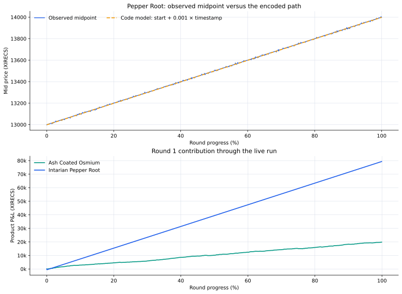

# Round 1 — one structural fair value, one deterministic trend

[← Repository overview](../../README.md) · [Cleaned strategy](trader.py) · [Machine-readable result](summary.json) · [Full results](../../docs/results.md#round-1)

| Final score | Products | Filled units | P&L-path fit | Positive sampled intervals |
|---:|---:|---:|---:|---:|
| **99,311.53** | 2 | 4,237 | 0.99993 R² | 99.8% |



## Round 1 in one sentence

I separated the two products by how their prices were formed: **Ash Coated Osmium** used an order-book-signature fair value with active and passive execution, while **Intarian Pepper Root** used a near-deterministic linear path and accumulated the maximum long position early.

The original notebook history is not part of the submission export, so the research sequence below is the cleanest evidence-based reconstruction of my process. The mechanics come directly from `trader.py`; every statistic comes from the supplied Round 1 result and log capsules.

## How I reached the two-model design

The first useful result came from treating the products separately instead of searching for a universal Round 1 rule.

| Research step | Ash Coated Osmium | Intarian Pepper Root |
|---|---|---|
| Plot the midpoint | A relatively stable center with short local movements | A linearly rising path across the round |
| Inspect the book | Repeated volume clusters at characteristic distances from the center | Direction mattered far more than short-term book noise |
| Choose a valuation model | Infer fair value from the recurring liquidity signatures | Fit a time-based fair value with slope close to `0.001` |
| Choose an execution style | Take clear dislocations, recycle inventory, then quote both sides | Reach +80 quickly and preserve the directional exposure |
| Add safeguards | Separate side capacity and position-dependent quote skew | Average-entry tracking, drawdown protection, and confirmed re-entry |

### What the capsule confirmed

| Measured pattern | Capsule result | Design decision |
|---|---:|---|
| Pepper Root fitted slope | `0.000999918` per timestamp unit | Encode a simple slope of `0.001` |
| Pepper Root linear fit | `R² = 0.999975` | Treat the drift as the primary signal |
| Pepper Root fit error | `1.43` XIRECS RMSE | Keep the model simple rather than fitting short-lived noise |
| Osmium median spread | `16` XIRECS | Combine passive spread capture with selective taking |
| Osmium signature coverage | `99.81%` of top-three snapshots | Use volume placement as the main fair-value source |
| Osmium two-sided flow match | `99.76%` | Run it as a balanced inventory-recycling engine |

## Ash Coated Osmium

### Observation: the depth carried more information than the raw midpoint

Osmium repeatedly displayed two recognizable liquidity groups:

- larger levels of at least 20 units roughly `10.5` ticks from the latent center; and
- medium levels of 10–15 units roughly `8` ticks from that center.

The capsule's published top-three book was enough to reconstruct this signal on **9,981 of 10,000 snapshots**. At least one large wall appeared on 95.97% of snapshots, a large wall appeared on both sides on 64.36%, and the medium-size signature appeared on 96.34%. Both signature classes appeared together on 92.50% of snapshots.

That suggested a structural interpretation: the recurring participants were revealing where they believed the center was, even when the best bid and ask moved around it. The reconstructed fair value changed by only 0.30 ticks per observation on average, compared with 2.19 ticks for the midpoint—more than seven times smoother while remaining responsive to the book.

### Fair-value construction

For each visible level, the strategy maps price back to a center candidate:

```text
large bid candidate = bid price + 10.5     when bid volume >= 20
large ask candidate = ask price - 10.5     when ask volume >= 20

medium bid candidate = bid price + 8       when 10 <= volume <= 15
medium ask candidate = ask price - 8       when 10 <= volume <= 15
```

Medium candidates must also sit within three ticks of their expected location. They receive weight `2`; large-wall candidates receive weight `1`:

```text
fair value = Σ(candidate × weight) / Σ(weight)
```

The higher weight on the medium signature reflects a deliberate choice to treat its location as the sharper center estimate. If no signature is available, the code falls back through the stored fair value, two-sided midpoint, and one-sided book estimates. In this live capsule, the signature was present often enough that fallback was rarely needed.

### Turning fair value into orders

The order engine follows a clear priority stack.

1. **Take the strongest edge first.** Buy asks at least two ticks below rounded fair value and sell bids at least two ticks above it.
2. **Recycle directional inventory.** If the remaining position can be reduced at fair value or better, clear it before adding passive exposure.
3. **Quote the residual capacity.** Begin around `fair ± 7`; join a nearby level or improve a more distant level by one tick.
4. **Keep quotes internally consistent.** The bid remains below fair, the ask remains above fair, and the two quotes cannot cross.
5. **Lean against inventory.** At 40 units, move both quotes one tick toward reducing the position; at 60 units, move them two ticks.

This separates signal from execution. The fair-value model says where the center is; the execution layer decides whether the current opportunity deserves an immediate trade, an inventory-clearing trade, or a passive quote.

### Live evidence

| Metric | Value |
|---|---:|
| Final product P&L | **19,908.53** |
| Fill events | 720 |
| Buy / sell events | 360 / 360 |
| Buy / sell volume | 2,081 / 2,076 |
| Average fill size | 5.77 |
| Buy / sell VWAP | 9,995.50 / 10,005.09 |
| VWAP separation | 9.60 XIRECS |
| Volume-weighted fill edge to reconstructed fair | 5.02 XIRECS |
| Observed inventory range | -32 to +63 |
| Ending position | +5 |

The flow is the strongest confirmation of the intended architecture: after 4,157 filled units, buy and sell volume differed by only five units. Osmium remained a two-sided engine throughout the run and converted that turnover into a steady 19,908.53 contribution.

## Intarian Pepper Root

### Observation: time explained almost the entire move

Pepper Root's valid two-sided midpoints increased by **1,001 XIRECS** from the first to the last snapshot. A least-squares fit gives:

```text
midpoint ≈ 13,000.004 + 0.000999918 × timestamp
R² = 0.999975
RMSE = 1.43 XIRECS
```

The executable model rounds that evidence into a robust rule:

```text
fair(t) = first observed midpoint + 0.001 × timestamp
```

Its error against valid two-sided capsule snapshots was only 2.04 XIRECS RMSE. That made a complex short-horizon forecaster unnecessary for the core position: the dominant opportunity was to acquire inventory early and let the path do the work.

### Entry and holding logic

The strategy targets the +80 position limit.

- It sweeps visible asks priced no more than ten ticks above modeled fair value.
- It continues level by level until the target is reached or the acceptable liquidity is exhausted.
- If capacity remains, it posts the balance passively at `floor(fair)`.
- It stores weighted average entry price so the protection layer is based on the position actually acquired.

The directional thesis is paired with a controlled reset mechanism. If marked drawdown on the long position crosses 2,000 XIRECS, the strategy exits at the best bid, waits 2,000 timestamp units, and requires a rolling slope above `0.0005` before its single permitted re-entry. The purpose is to preserve conviction while still demanding fresh confirmation after a regime change.

### Live evidence

| Metric | Value |
|---|---:|
| Final product P&L | **79,403.00** |
| Share of Round 1 P&L | 79.95% |
| Fill events | 8 buys |
| Filled volume | 80 |
| Buy VWAP | 13,007.36 |
| Target reached | Timestamp 900 |
| Round spent at target after acquisition | 99.91% |
| Ending position | +80 |

The live fill sequence matched the design closely: the strategy completed its 80-unit target in eight fills between timestamps 0 and 900, then retained the directional exposure for essentially the entire round.

## How the two strategies worked together

The products contributed through different economic mechanisms, which made them complementary rather than redundant.

| Dimension | Ash Coated Osmium | Intarian Pepper Root |
|---|---|---|
| Primary edge | Structural order-book placement | Persistent time trend |
| Holding horizon | Repeated short inventory cycles | Almost the full round |
| Execution | Active taking + inventory clearing + passive quoting | Early multi-level acquisition |
| Fill events | 720 | 8 |
| Final contribution | 20.05% | 79.95% |

### Contribution through the round

| Timestamp | Osmium P&L | Pepper Root P&L | Combined P&L |
|---:|---:|---:|---:|
| 250,000 | 5,214.19 | 19,411.00 | 24,625.19 |
| 500,000 | 10,170.22 | 39,411.00 | 49,581.22 |
| 750,000 | 15,087.53 | 59,411.00 | 74,498.53 |
| Final | **19,908.53** | **79,403.00** | **99,311.53** |

The 500-point exported P&L path had `R² = 0.999933` against time, and 99.8% of its sampled interval changes were positive. Both product engines therefore contributed to a highly consistent round-level path.

## Reproducible capsule replay

I added a dedicated analyzer for this round:

```bash
python scripts/analyze_round_one.py
```

It parses both raw local exports, rebuilds the product metrics, reconstructs Osmium fair value from the published top-three depth, and executes the cleaned `Trader` over all 10,000 capsule snapshots using the actual fill-derived position path.

The replay completed without an exception, reproduced the exported ending positions of `+5` Osmium and `+80` Pepper Root, and passed independent buy-side and sell-side capacity checks on every snapshot. Because the activity export includes only three levels per side, this is a deterministic diagnostic replay rather than a replacement for the full competition simulator.

## What Round 1 established

Round 1 gave me four principles that shaped the later system:

1. start by identifying how each product forms price;
2. use the simplest fair-value model that matches that structure;
3. separate valuation, execution, inventory, and protection into distinct layers; and
4. validate the story against fills and product-level P&L, not only the final score.

Round 2 then explored the natural extensions: a slower adaptive center and richer microstructure for Osmium, plus an online trend, pullback logic, and more selective execution for Pepper Root.
