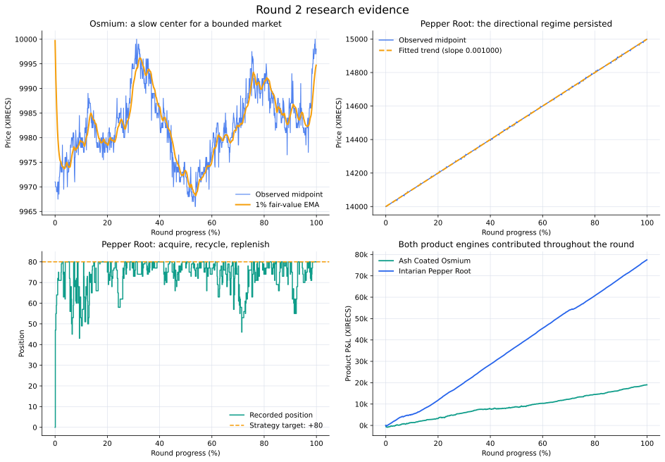

# Round 2 — turning strong priors into adaptive execution

[← Repository overview](../../README.md) · [Cleaned strategy](trader.py) · [Machine-readable result](summary.json) · [Full results](../../docs/results.md#round-2)

| Final score | Product engines | Fill events | Filled units | Positive sampled P&L changes |
|---:|---:|---:|---:|---:|
| **96,567.54** | 2 | 1,175 | 6,321 | **488 / 499 (97.8%)** |



Round 1 established the central idea: Osmium and Pepper Root needed different models. In Round 2 I kept that product split and made the decision layer adaptive. Osmium received a slow fair-value state with variance- and inventory-aware reservations; Pepper Root received an online trend, a target-position model, multi-level sweeps, and quote ladders.

## The research question

The capsule shows two sharply different regimes:

| Observed property | `ASH_COATED_OSMIUM` | `INTARIAN_PEPPER_ROOT` |
|---|---:|---:|
| Opening → final midpoint | 9,971 → 9,999 | 14,000 → 15,000 |
| Midpoint range | 9,962.5–10,003 | 13,996.5–15,001 |
| Midpoint standard deviation | 7.18 | 288.68 |
| Fitted time slope | 0.00000782 | **0.000999991** |
| Time-trend $R^2$ | 0.09875 | **0.999980** |
| Median displayed spread | 16 | 15 |

My interpretation was:

- **Osmium:** estimate a center slowly, then let visible liquidity, short-run variance, and inventory determine how to trade around it.
- **Pepper Root:** learn the directional path online, maintain long exposure, and recycle inventory when price temporarily became rich or cheap relative to that path.

That distinction shaped every valuation and execution choice below.

## What changed from Round 1

| Layer | Round 1 | Round 2 |
|---|---|---|
| Osmium fair value | Inferred mainly from recurring size/price book shapes | Persistent 1% midpoint EMA |
| Osmium risk | Threshold-based inventory skew | Variance-scaled reservation value with three inventory tiers |
| Osmium quoting | Take, clear, and improve | Active taking plus state-dependent one- or two-level quoting |
| Pepper trend | Encoded linear path | Online 500-observation least-squares trend |
| Pepper signal | Trend-relative price | Trend + deep imbalance + inventory target + pullback bonus |
| Pepper execution | Acquire and hold the directional position | Sweep dips, replenish through a three-level buy ladder, and score sell prices |

The result was not merely more order flow. Each extra execution rule had a specific role: acquire exposure, retain it, recycle it, or keep quotes inside the ±80 position limit.

## Ash Coated Osmium

### 1. Observation → hypothesis

Osmium stayed within a 40.5-tick midpoint range and had little linear relationship with time. Its displayed spread was usually wide: the median was 16 ticks. I therefore treated the market as a bounded center surrounded by repeated execution opportunities.

The working hypothesis was that fair value should move more slowly than the top of book, while the reservation price should react immediately to inventory and short-run microprice variance.

### 2. Slow fair-value state

With midpoint $M_t$, the code updates:

$$
F_t=0.01M_t+0.99F_{t-1}, \qquad F_0=10{,}000.
$$

The 1% update rate has a half-life of about 69 observations. It filters transient book movement without freezing the center for the entire round.

The 10,000-snapshot reconstruction shows that this state behaved as intended:

| EMA diagnostic | Result |
|---|---:|
| First updated fair | 9,999.71 |
| Final fair | 9,995.01 |
| Mean fair | 9,982.37 |
| Fair range | 9,968.18–9,999.71 |
| Median absolute fair–mid gap | 1.62 ticks |
| Snapshots within five ticks of midpoint | **94.28%** |
| Snapshots within ten ticks of midpoint | **99.02%** |

The strategy also maintains a rolling 150-mid context anchor, clipped to 10,000 ±10 after warm-up. In this historical version that state is persisted for context; the executable reservation center is the EMA above.

### 3. Microprice, variance, and inventory

The immediate book state enters through L1 microprice:

$$
\mu_t=\frac{V_t^bA_t+V_t^aB_t}{V_t^b+V_t^a},
$$

where $B_t,A_t$ are the best bid and ask and $V_t^b,V_t^a$ are their displayed sizes. The latest 20 microprices produce a sample variance $\sigma_t^2$, floored at 1.

Inventory sensitivity rises in three tiers:

| Absolute position | $\gamma$ |
|---:|---:|
| 0–30 | 0.004 |
| 31–55 | 0.007 |
| 56–80 | 0.012 |

For position $q_t$, the reservation center is:

$$
R_t=F_t-q_t\gamma\sigma_t^2.
$$

The executable width is:

$$
\delta_t=\operatorname{clip}(1+\gamma\sigma_t^2,1.5,8),
$$

with buy and sell thresholds placed around $R_t$. A long position lowers both thresholds; a short position raises them. This connects inventory directly to the prices at which the system is willing to add or release risk.

Variance was modest in this capsule—median 1.00 and 95th percentile 2.56—so the width stayed controlled while the inventory term shifted the reservation center.

### 4. Translating value into orders

The Osmium engine builds orders in layers:

1. **Take clear edge.** Sweep displayed asks at or below the buy threshold and bids at or above the sell threshold.
2. **Use a near-fair band.** If projected absolute position remains inside 25, the engine can also trade visible prices one tick around fair. From timestamp 900,000, that gate expands when inventory is material, creating more opportunities to rebalance late in the run.
3. **Improve worthwhile queues.** A best level with at least four units can be improved by one tick when the reservation price still supports it.
4. **React to a recurring L1 shape.** If spread is at least ten and either best-level size is 8–16, remaining capacity is concentrated at the inner quote. This shape appeared in **95.42%** of exported snapshots.
5. **Diversify the ordinary quote.** Outside that shape, remaining capacity is split 50/50 between the inner price and a quote three ticks deeper.

The active and passive layers are each capacity-checked independently against the ±80 limit. Dedicated one-sided-book branches retain the last fair state and quote from it.

### 5. Recorded outcome

| Metric | Result |
|---|---:|
| Final product P&L | **19,007.54** |
| Share of Round 2 P&L | 19.68% |
| Fill events / filled units | 719 / 4,021 |
| Buy volume / sell volume | 2,012 / 2,009 |
| Buy VWAP / sell VWAP | 9,977.90 / 9,987.33 |
| VWAP separation | **9.43 ticks** |
| Matched-flow ratio | **99.85%** |
| Ending position | **+3** |
| Replayed fill edge to EMA | **5.45 ticks per unit** |
| Volume with positive replayed edge | **98.73%** |

The nearly equal two-sided volume and +3 ending inventory are consistent with the intended market-making role: recycle risk around a slowly moving center and finish with little residual position.

## Intarian Pepper Root

### 1. Observation → hypothesis

Pepper Root rose exactly 1,000 midpoint ticks over the round. A linear fit explains 99.998% of midpoint variance, with a slope of 0.000999991 per timestamp unit.

I wanted to preserve the directional exposure from Round 1 while making “cheap” and “rich” relative to a trend learned from current data. That led to an online regression for the base value and faster adjustments for inventory, pressure, and pullbacks.

### 2. Online trend and fair value

The reference price is L1 microprice. The strategy keeps:

- a 60-observation reference history;
- a five-observation short mean; and
- a 500-observation rolling least-squares trend.

After 20 trend observations, the base value is the regression prediction 50 timestamp units ahead. During warm-up it is the mean of the available history.

The full executable model is:

$$
\text{fair}_t=
\widehat P_t(t+50)
+5(\operatorname{OBI}^{deep}_t-0.5)
-0.15m(q_t)(q_t-80)
+0.8\max(\operatorname{MA}_{5,t}-\mu_t,0),
$$

where $m(q)=1.5$ below the +80 target and 0.5 above it. Below target, the inventory term is especially intuitive:

$$
0.225(80-q_t).
$$

Every missing unit raises fair by 0.225 ticks, encouraging replenishment. Deep order-book imbalance contributes a smaller real-time pressure adjustment, while the pullback term temporarily raises fair when microprice falls below its short mean.

The reconstructed rolling slope was exceptionally stable:

| Rolling-trend diagnostic | Result |
|---|---:|
| Median slope | 0.00100024 |
| 10th–90th percentile | 0.00099441–0.00100531 |
| Mean absolute OBI adjustment | 0.014 ticks |
| Mean inventory adjustment | 1.36 ticks |
| 90th-percentile inventory adjustment | 4.05 ticks |
| Snapshots with an active pullback bonus | 11.94% |

### 3. Why the +80 target mattered

The trend signal was expressed through persistent inventory rather than prediction alone. The target-position term made the system value a unit more highly when exposure fell below +80, so sales could be followed by replenishment instead of permanently giving up the directional position.

The live snapshots make that mechanism visible:

| Timestamp | Position | Reference | Fair | Interpretation |
|---:|---:|---:|---:|---|
| 50,000 | 80 | 14,050.00 | 14,050.19 | Target reached; fair stays close to trend |
| 100,000 | 53 | 14,100.00 | 14,106.33 | Missing inventory raises fair by about six ticks |
| 500,000 | 80 | 14,504.80 | 14,500.22 | Model distinguishes a rich microprice from the trend |
| 950,000 | 70 | 14,950.00 | 14,952.83 | Replenishment pressure returns below target |

### 4. Aggressive execution

The active layer buys when the best ask is at least one tick below fair, or when L1 imbalance is at least 0.56 and the ask is no higher than fair.

Pullbacks control how deeply it sweeps:

- a one-tick dip can extend the take ceiling toward `fair + 1`; and
- a three-tick dip can extend it toward `fair + 2`.

Aggressive selling is deliberately selective and requires a positive position: either the best bid is at least ten ticks above fair, or sell-side L1 pressure is strong and the bid is at least two ticks above fair.

### 5. Passive ladders and quote scoring

After active orders, unused capacity becomes three-level ladders:

| Side | Size allocation | Price offsets from base |
|---|---|---|
| Buy | 50% / 30% / 20% | 0 / −1 / −2 |
| Sell | 25% / 37.5% / 37.5% | 0 / +1 / +2 |

For spreads of at least six ticks, the provisional passive prices improve the market by three ticks. In narrower markets they can improve by one tick when the spread clears a volatility-aware minimum. The buy ladder uses that fair-capped provisional bid; the sell selector separately compares the best ask with a one-tick improvement before using its fallback price.

The sell side compares the best ask with a one-tick improvement and scores each eligible candidate as:

$$
\text{score}=\text{edge}\times\widehat{\Pr}(\text{fill}).
$$

Estimated fill probability combines competitiveness, contra-side pressure, and a queue penalty:

$$
\widehat{\Pr}(\text{fill})=
\operatorname{clip}\left(
0.16+0.52C+0.26P-0.14Q,
0.05,0.95
\right).
$$

The candidate needs at least 0.03 ticks of edge and a score of 0.02. If neither candidate clears the score, the engine still constructs a fair-value-protected sell ladder. Scoring therefore chooses the preferred sell price; it does not switch the quoting engine off.

### 6. Recorded outcome

| Metric | Result |
|---|---:|
| Final product P&L | **77,560.00** |
| Share of Round 2 P&L | **80.32%** |
| Fill events / filled units | 456 / 2,300 |
| Buy volume / sell volume | 1,190 / 1,110 |
| Ending position | **+80** |
| Mean / median position | +73.89 / +77 |
| Time at position ≥60 | **92.68%** |
| Time between +70 and +80 | **79.95%** |
| Time exactly at +80 | 34.78% |

Pepper Root increased from eight Round 1 fills to 456 Round 2 fills while preserving the same +80 ending exposure. The 1,110 units sold and later replenished show the execution layer doing more than passive carry: it repeatedly recycled inventory around the learned path.

## Active and passive fill mix

Classifying each submission fill against the exported best bid and ask at its timestamp confirms that both execution modes were used:

| Product and side | Aggressive events / units | Passive events / units |
|---|---:|---:|
| Osmium buys | 138 / 910 | 218 / 1,102 |
| Osmium sells | 135 / 805 | 228 / 1,204 |
| Pepper Root buys | 145 / 752 | 121 / 438 |
| Pepper Root sells | 71 / 496 | 119 / 614 |

Osmium received more volume passively on both sides, matching its market-making role. Pepper Root combined assertive acquisition with passive replenishment and release, matching the directional target plus recycling design.

## Combined result through the round

| Progress | Osmium P&L | Pepper Root P&L | Combined P&L |
|---:|---:|---:|---:|
| 25% | 4,845.56 | 16,027.00 | 20,872.56 |
| 50% | 8,655.06 | 36,978.00 | 45,633.06 |
| 75% | 13,372.53 | 56,719.00 | 70,091.53 |
| Final | **19,007.54** | **77,560.00** | **96,567.54** |

Both products contributed positive P&L in every 100,000-timestamp interval. The sampled combined path had $R^2=0.99923$ against time and 488 positive changes out of 499, finishing at **96,567.54 XIRECS**.

## Reproducible decision audit

The dedicated analyzer reconstructs the exported three-level books, uses one persistent `Trader`, carries `traderData` forward, and rebuilds positions only from submission fills with timestamps strictly earlier than the current decision. Recorded fills at timestamp $t$ are applied after the strategy decision at $t$, preventing lookahead.

```bash
python scripts/analyze_round_two.py
```

It verifies:

- 10,000 decision snapshots completed without an exception;
- reconstructed ending positions exactly matched +3 and +80;
- every buy and sell side independently respected the ±80 limit;
- zero conversions and zero projected limit violations;
- all 19 live debug checkpoints were recovered; and
- replayed fair values stayed within 0.52 ticks of logged live fair values.

This is a deterministic decision audit, not a counterfactual exchange simulator. The export contains three visible levels, while live matching can depend on queue priority and additional depth. The replay is therefore used to validate state, valuation, order shape, and risk—not to manufacture hypothetical P&L.

## What I carried forward

Round 2 established four durable ideas for the later rounds:

1. **Learn the state online.** A persistent trend or fair-value estimate can replace a fixed round-long assumption without losing the original economic view.
2. **Separate valuation from execution.** The same fair value can support taking, queue improvement, passive ladders, and inventory control.
3. **Express a directional thesis through a target.** Pepper Root's +80 target connected the forecast to actual exposure and replenishment behavior.
4. **Audit decisions causally.** Replaying exact historical state made it possible to connect code parameters to orders, fills, inventory, and the final score.

Round 3 then expanded this framework from two independent spot products to underlyings, vouchers, portfolio delta, and expiry-aware risk.
