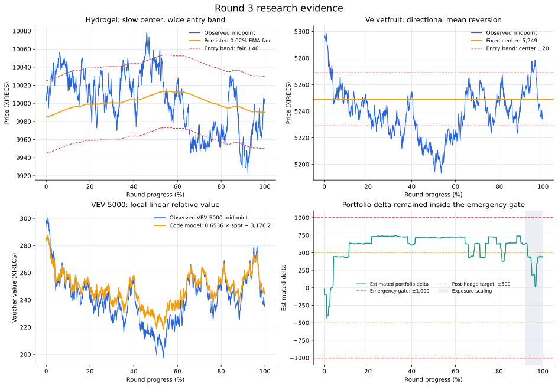

# Round 3 — building a delta-aware derivatives portfolio

[← Repository overview](../../README.md) · [Cleaned strategy](trader.py) · [Machine-readable result](summary.json) · [Full results](../../docs/results.md#round-3)

| Final score | Observed markets | Active routes | Fill events | Filled units |
|---:|---:|---:|---:|---:|
| **33,767.52** | 12 | 10 | 4,026 | 25,817 |



Round 3 changed the problem from two independent products into a portfolio: two core markets, ten call vouchers on Velvetfruit Extract, shared inventory risk, and a shrinking time horizon. My response was to route each market to the model that matched its structure instead of forcing all twelve books through one valuation formula.

The submitted system combined stable-center mean reversion, book-envelope market making, local delta models, end-of-round exposure scaling, and an emergency portfolio-delta circuit breaker. Five profitable sleeves generated **68,999.66 XIRECS** of gross positive contribution, led by Hydrogel and `VEV_5000`, and the complete portfolio finished at **33,767.52 XIRECS**.

## The architecture

| Market family | Valuation | Execution | Risk role |
|---|---|---|---|
| `HYDROGEL_PACK` | Ultra-slow EMA center | 20-unit threshold trades and center exits | Independent ±200 mean-reversion sleeve |
| `VELVETFRUIT_EXTRACT` | Fixed 5,249 center | 20-unit directional mean reversion | Core sleeve and emergency hedge instrument |
| `VEV_4000`, `VEV_4500` | Visible book-envelope midpoint | Selective taking plus continuous two-sided quotes | Low-inventory deep-ITM market making |
| `VEV_5000`–`VEV_5500` | Strike-specific `delta × spot + offset` | Mispricing-sized top-of-book trades | Local relative value with asymmetric caps |
| `VEV_6000`, `VEV_6500` | No active valuation route | Deliberately no orders | Observed far-strike controls |
| Whole voucher book | Static delta aggregation | Velvetfruit hedge only beyond an emergency gate | Portfolio-level circuit breaker |

This routing decision is the central Round 3 idea. A liquid mean-reverter, a deep-in-the-money voucher, and a low-priced far strike may share an underlying, but they do not share the same useful signal or execution style.

## What the capsule showed

| Market | Midpoint range | Midpoint stdev | Median spread | Model implication |
|---|---:|---:|---:|---|
| Hydrogel | 9,923–10,081 | 32.95 | 16 | Wait for wide deviations around a slow center |
| Velvetfruit | 5,191.5–5,300 | 18.59 | 5 | Use directional thresholds rather than continuous quoting |
| `VEV_4000` | 1,189–1,302 | 18.63 | 21 | Wide enough for two-sided wall-mid execution |
| `VEV_4500` | 690.5–800.5 | 18.62 | 16 | Wall-mid execution plus an intrinsic-value guard |
| `VEV_5000` | 196.5–301.5 | 17.85 | 6 | Trade deviations from a local spot relationship |

The code translates these observations into four separate engines.

## 1. Hydrogel Pack — slow-center mean reversion

### Observation and hypothesis

Hydrogel travelled through a 158-tick range, yet its opening and final midpoints were only seven ticks apart: 10,008 and 10,001. That combination—large excursions with a comparatively stable long-run level—supported a mean-reversion model with a deliberately slow center.

The capsule provides forward evidence for that interpretation. When midpoint was at least 40 ticks from the submitted fair:

| Forward horizon | Mean movement toward fair | Observations moving toward fair |
|---:|---:|---:|
| 10,000 timestamp units | **5.48 ticks** | **63.49%** |
| 50,000 timestamp units | **18.81 ticks** | **80.42%** |

These statistics are descriptive post-run validation. The executable signal itself remains the simple threshold rule below.

### Persistent fair value

The strategy begins at 9,985 and updates the center by only 0.02% per observation:

$$
F_t=0.0002M_t+0.9998F_{t-1}, \qquad F_0=9{,}985.
$$

The returned value is rounded to two decimals and persisted in `traderData` for the next snapshot. Its half-life is approximately 3,465 observations, so it follows durable movement while leaving short-lived excursions available to the trading rule.

| Fair-value diagnostic | Result |
|---|---:|
| First persisted fair | 9,985.00 |
| Final persisted fair | 9,990.06 |
| Fair range | 9,985.00–10,013.26 |
| Mean fair | 10,000.62 |
| Largest cheap deviation | −69.40 ticks |
| Largest rich deviation | +73.74 ticks |

### Execution lifecycle

For deviation $d_t=M_t-F_t$:

- buy up to 20 units at the best ask when $d_t\leq-40$;
- sell up to 20 units at the best bid when $d_t\geq40$;
- close a long when midpoint returns to fair or higher;
- close a short when midpoint returns to fair or lower; and
- keep directional exposure within ±200.

The engine uses marketable top-of-book orders only after the deviation gate is crossed. That makes it selective in time even though execution is aggressive once the signal appears.

### Recorded outcome

| Metric | Result |
|---|---:|
| Final P&L | **27,719.00** |
| Completed flat-to-flat cycles | **6** |
| Profitable completed cycles | **6 / 6** |
| Fill events / units | 187 / 2,258 |
| Buy volume / sell volume | 1,129 / 1,129 |
| Buy VWAP / sell VWAP | 9,993.36 / 10,017.91 |
| Matched-flow separation | **24.55 ticks** |
| Position range | −200 to +200 |
| Ending position | **0** |

All six completed inventory cycles were profitable, and the sleeve finished flat. The equal buy and sell volume also reconciles the final product P&L directly to completed trading rather than a residual mark.

## 2. Velvetfruit Extract — directional mean reversion

### Why a second spot model

Velvetfruit had a much tighter five-tick median spread and a lower-volatility center around 5,249. Instead of maintaining continuous quotes, I used it as a threshold-driven directional sleeve and reserved it as the instrument that could hedge voucher delta if the portfolio became extreme.

The submitted model is intentionally compact:

```text
fair value        = 5,249
entry band        = fair ±20
order lot         = 20
directional cap   = ±100
hard product limit = ±200
```

The ±100 trading cap leaves additional room inside the hard ±200 product limit for the emergency hedge layer.

### Signal and execution

For $d_t=M_t-5{,}249$:

- buy the best ask when $d_t\leq-20$;
- sell the best bid when $d_t\geq20$;
- close long inventory when midpoint reaches 5,249;
- cover short inventory when midpoint reaches 5,249; and
- clip each order to 20 units, visible top-level quantity, and remaining directional capacity.

Threshold observations subsequently moved toward the center by an average 3.35 ticks over 10,000 timestamp units and 11.51 ticks over 50,000. The corresponding reversion frequencies were 61.85% and 68.02%.

### Recorded outcome

| Metric | Result |
|---|---:|
| Final P&L | **14,130.00** |
| Completed flat-to-flat cycles | **7** |
| Profitable completed cycles | **7 / 7** |
| Fill events / units | 78 / 1,320 |
| Buy volume / sell volume | 660 / 660 |
| Buy VWAP / sell VWAP | 5,238.38 / 5,259.79 |
| Matched-flow separation | **21.41 ticks** |
| Position range | −100 to +100 |
| Ending position | **0** |

Together, the two core mean-reversion engines contributed **41,849 XIRECS**, completed thirteen profitable flat-to-flat cycles, and both ended with zero inventory.

## 3. Deep-ITM vouchers — visible book-envelope value

### Why the outer book

`VEV_4000` and `VEV_4500` are deep enough in the money that their midpoints closely track intrinsic value:

$$
\text{voucher value}\approx S-K.
$$

Against that identity, the capsule gives:

| Product | Identity $R^2$ | Identity RMSE | Mean absolute top-mid parity gap |
|---|---:|---:|---:|
| `VEV_4000` | 0.997639 | 0.91 | 0.30 ticks |
| `VEV_4500` | 0.998200 | 0.79 | 0.41 ticks |

The code does not search for the largest wall or track persistent participants. It uses the visible book envelope, reconstructed here from the three exported levels:

$$
W_t=\frac{\text{lowest visible bid}+\text{highest visible ask}}{2}.
$$

This reduces dependence on a flickering best quote. The wall midpoint changed 21.2% less per observation than top-mid for `VEV_4000` and 16.8% less for `VEV_4500`. For `VEV_4500`, its mean absolute gap to intrinsic was 0.26 ticks and it equalled intrinsic on 61.57% of snapshots.

### Maker/taker construction

The wall engine performs four jobs in sequence:

1. Buy visible asks strictly below $W_t$ and sell visible bids strictly above it.
2. Allow a price exactly at $W_t$ only when it reduces an opposing position.
3. Build one passive bid below fair and one passive ask above fair, improving an eligible visible level by one tick when possible.
4. Scale remaining passive capacity during the final 8% of the round.

This produced 20,000 passive quote instructions per product—one bid and one ask on every snapshot—while only crossing when the envelope offered immediate edge.

### Recorded outcome

| Metric | `VEV_4000` | `VEV_4500` |
|---|---:|---:|
| Final P&L | **2,705.02** | **1,999.02** |
| Fill events / units | 159 / 324 | 159 / 324 |
| Passive filled volume | 282 | 282 |
| Passive share of volume | **87.04%** | **87.04%** |
| Volume with positive wall-mid edge | **93.83%** | **93.83%** |
| Volume with nonnegative wall-mid edge | **100%** | **100%** |
| Recorded position range | −17 to +13 | −17 to +13 |
| Ending position | +2 | +2 |

The two wall sleeves contributed **4,704.03 XIRECS** while keeping realized inventory small relative to the ±300 product limits.

### `VEV_4500` parity guard

The additional parity layer compares the best voucher quotes with $S-4{,}500$. Its buffer is:

$$
\max\left(2,\frac{\text{current spread}}{2}\right),
$$

and any qualifying trade is capped at 30 units. The guard evaluated every snapshot but found no dislocation beyond its spread-aware threshold in this capsule. It therefore remained a dormant validation layer while the wall-mid engine supplied the live orders.

## 4. VEV 5000–5500 — strike-specific local delta

### Model choice

For the middle strikes, I used a first-order local approximation rather than one global voucher formula:

$$
\widehat V_i(S)=\Delta_iS+b_i.
$$

The slope acts like a locally calibrated spot sensitivity; the intercept absorbs the strike and the time-value baseline over the calibration region. The decreasing slopes across higher strikes are economically coherent with lower call delta.

| Voucher | Submitted $\Delta$ | Offset $b$ | Open threshold | Close threshold | Median 100k-window spot $R^2$ |
|---|---:|---:|---:|---:|---:|
| `VEV_5000` | 0.6536 | −3,176.2 | 5.0 | 0.0 | **0.99733** |
| `VEV_5100` | 0.5774 | −2,864.5 | 4.0 | 0.3 | **0.99677** |
| `VEV_5200` | 0.4367 | −2,197.1 | 3.0 | 0.0 | **0.99515** |
| `VEV_5300` | 0.2727 | −1,385.0 | 1.5 | 0.0 | **0.99127** |
| `VEV_5400` | 0.1289 | −660.6 | 2.0 | 0.5 | 0.95435 |
| `VEV_5500` | 0.0549 | −281.4 | 3.0 | 0.3 | 0.71255 |

The $R^2$ column measures each voucher's observed local relationship with spot in rolling 100,000-timestamp windows. It validates why a linear first-order model was a useful Round 3 starting point; the executable coefficients are the submitted constants shown in the table.

### Mispricing and size

For voucher midpoint $M_i$, define:

$$
d_i=M_i-\widehat V_i(S).
$$

Before the end-of-round multiplier, order size is:

$$
L_i=\operatorname{clip}\left(
\left\lfloor25\frac{|d_i|}{\max(\text{open threshold},0.5)}\right\rfloor,
5,40
\right).
$$

The strategy waits until timestamp 10,000 before activating these routes. An underpriced midpoint opens or extends a long at the best ask; an overpriced midpoint opens or extends a short at the best bid. Long inventory closes when deviation reaches the strike's long-close boundary, and short inventory closes when it reaches the short-close boundary.

Risk is asymmetric:

- long inventory may reach the hard +300 limit;
- newly initiated short inventory stops at −250; and
- opening size rises with absolute model deviation, from roughly 25 units at threshold to a maximum of 40 before time scaling.

All orders in these six routes execute at the current best bid or ask; passive quoting belongs to the deep-ITM wall engines, not the local-linear engines.

### `VEV_5000` as the strongest calibration

`VEV_5000` showed the cleanest combination of spot linkage, two-sided turnover, and realized contribution:

| Metric | Result |
|---|---:|
| Final P&L | **22,446.63** |
| Fill events / units | 749 / 5,153 |
| Buy volume / sell volume | 2,584 / 2,569 |
| Matched-flow ratio | **99.42%** |
| Buy VWAP / sell VWAP | 249.21 / 258.03 |
| VWAP separation | **8.83 ticks** |
| Observed spot-link $R^2$ | **0.998608** |
| Observed spot-link RMSE | 0.67 ticks |
| Ending position | +15 |

The remaining linear strikes expanded the live cross-strike evidence that informed the next iteration. The especially strong rolling spot relationships through `VEV_5300` suggested retaining strike-specific sensitivity while adding time and surface structure in Round 4.

### Selective inactivity at the far strikes

`VEV_6000` and `VEV_6500` remained in the product-limit and portfolio-delta maps but had no active trading route. Their midpoints stayed fixed at 0.5, and the strategy returned no orders or fills for either market. Treating “no trade” as a valid decision prevented the portfolio from manufacturing activity where this submission had no valuation edge.

## 5. Portfolio delta and lifecycle controls

### Shared delta language

The strategy estimates portfolio sensitivity as:

$$
D_t=q_t^{VE}+\sum_i q_{i,t}\widehat\Delta_i.
$$

The voucher weights are:

| Voucher | Delta estimate | Voucher | Delta estimate |
|---|---:|---|---:|
| `VEV_4000` | 1.0000 | `VEV_5300` | 0.2727 |
| `VEV_4500` | 0.8200 | `VEV_5400` | 0.1289 |
| `VEV_5000` | 0.6536 | `VEV_5500` | 0.0549 |
| `VEV_5100` | 0.5774 | `VEV_6000` | 0.0100 |
| `VEV_5200` | 0.4367 | `VEV_6500` | 0.0010 |

Hydrogel is independent and excluded. If $|D_t|>1{,}000$, the code computes a Velvetfruit hedge toward a residual magnitude of 500, then clips that order to the ±200 hard limit and visible best-level quantity.

### What happened in the recorded portfolio

| Delta diagnostic | Result |
|---|---:|
| Minimum estimated delta | −437.71 |
| Maximum estimated delta | +742.72 |
| 95th-percentile absolute delta | 737.26 |
| Ending estimated delta | **+445.19** |
| Emergency threshold crossings | **0** |
| Emergency hedge orders | **0** |

The portfolio remained inside the ±1,000 emergency band throughout the run and ended inside the ±500 target band. The hedge was available as a last-resort control without creating unnecessary underlying turnover.

### End-of-round scaling

Let $T=999{,}900$. For the wall-mid and linear-voucher routes, the size multiplier is:

$$
s(t)=
\begin{cases}
1, & t<0.92T,\\
\max\left(0.05,\frac{T-t}{T-0.92T}\right), & t\geq0.92T.
\end{cases}
$$

Scaling begins on the timestamp grid at 920,000 and falls to 0.05 at the final snapshot. Once it is below 0.3—starting at 976,000—linear vouchers with more than ten units also send a lot-sized reduction order. This is exposure scaling and reduction, not a forced complete flattening rule.

## Portfolio outcome

| Profitable sleeve | Final contribution | Fills | Units | Ending position |
|---|---:|---:|---:|---:|
| Hydrogel | **27,719.00** | 187 | 2,258 | 0 |
| Velvetfruit | **14,130.00** | 78 | 1,320 | 0 |
| `VEV_4000` | **2,705.02** | 159 | 324 | +2 |
| `VEV_4500` | **1,999.02** | 159 | 324 | +2 |
| `VEV_5000` | **22,446.63** | 749 | 5,153 | +15 |
| **Gross positive contribution** | **68,999.66** | **1,332** | **9,379** |  |

The full twelve-market portfolio finished with a positive score of **33,767.52 XIRECS**. Hydrogel was the largest individual contributor, the two core products both completed every closed cycle profitably, the wall sleeves combined passive spread capture with low realized inventory, and `VEV_5000` demonstrated that a strike-specific local valuation could scale to substantial turnover.

## Reproducible 10,000-snapshot audit

The dedicated analyzer constructs all twelve exported three-level books, instantiates the exact cleaned `Trader`, carries the rounded Hydrogel fair through `traderData`, and supplies only positions created by fills strictly before the current timestamp.

```bash
python scripts/analyze_round_three.py
```

It verifies:

- all 120,000 activity rows and 10,000 timestamp states were processed;
- all **4,026 fills and 25,817 units** matched a returned order at the same timestamp, side, and price within available order capacity;
- fill-derived ending positions match the capsule exactly;
- every recorded position stayed inside its configured limit;
- Hydrogel fair persisted from 9,985.00 to 9,990.06;
- the parity guard and emergency hedge each had zero qualifying snapshots;
- `VEV_6000` and `VEV_6500` returned no orders; and
- conversions remained zero.

This is an exact historical decision audit. It validates the code path and proves that every recorded fill is supported by a returned order. It does not reassign passive fills to hypothetical strategies or claim exchange behavior beyond the exported book.

## What I carried into Round 4

Round 3 established the portfolio framework:

1. **Route by market structure.** Core mean reversion, wall-mid quoting, local relative value, and inactivity can coexist in one system.
2. **Treat delta as shared risk language.** A voucher book becomes easier to reason about when every position maps back to underlying sensitivity.
3. **Calibrate each strike separately.** Local slopes captured the changing spot sensitivity across the chain.
4. **Design the full lifecycle.** Warm-up, entry, closing, asymmetric caps, emergency hedging, and final-period scaling belong in the model together.

Round 4 retained that architecture and added more stable underlying valuation, informed-flow features, and a volatility-surface consistency layer for the voucher book.
