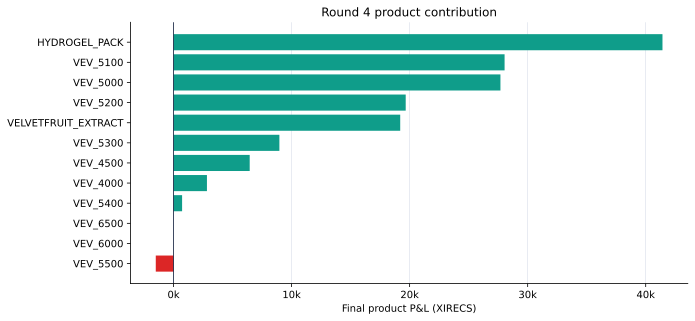

# Round 4 — stable midpoints, flow-aware fair value, and volatility filters

[← Repository overview](../../README.md) · [Cleaned strategy](trader.py) · [Machine-readable result](summary.json) · [Full results](../../docs/results.md#round-4)

| Final score | Products | Fill events | Filled units | Improvement over Round 3 |
|---:|---:|---:|---:|---:|
| **153,493.93** | 12 | 3,852 | 42,893 | +119,726.41 |

## What I changed after Round 3

Round 4 focused less on adding independent signals and more on making the shared state estimate cleaner across the same broad product universe.

The central changes were:

1. use outer-book stability for Hydrogel;
2. separate aggressive mean-reversion inventory from passive market-making inventory;
3. treat selected counterparty flow as information rather than generic volume; and
4. reject voucher directions that disagreed too strongly with a fitted implied-volatility surface.

## Hydrogel Pack

### Observation

Top-of-book quotes could flicker while deeper edges remained more stable. Passive market making could also blend with directional mean-reversion positions because the same net inventory could represent two different intentions.

### Hypothesis

An outer-book midpoint would be a calmer anchor, and tracking aggressive inventory separately would let the strategy close the trade it deliberately opened without confusing it with passive fills.

### Implementation

- Fair value starts near 9,995 and moves with an ultra-slow EMA.
- The midpoint uses the outermost visible bid and ask.
- A decaying flow score from one counterparty pseudonym shifts the EMA by at most three ticks.
- A 31-tick deviation triggers 20-unit aggressive mean-reversion entries.
- Aggressive long and short quantities are persisted separately and reconciled against real position.
- Passive market making activates only when no aggressive inventory remains, quoting around a long-term-mean-adjusted center with a seven-tick half-spread.

This architecture separates “I own this because I expect reversion” from “I own this because my quote was filled.”

## Velvetfruit and the vouchers

### Flow-adjusted center

Velvetfruit uses a very slow EMA plus a decaying score from selected counterparty trades. One participant is followed more strongly; another is lightly faded. The score is capped so short bursts cannot move fair value without bound.

### Zone strategy

The strategy drives Velvetfruit and seven vouchers toward long, short, or flat inventory zones based on distance from the adjusted center:

- outside the normal band, move toward maximum directional exposure;
- inside a narrow flat band, return toward zero; and
- during a sustained underlying uptrend, widen the sell threshold to avoid fighting momentum too early.

A specific flow sequence acts as a temporary crash warning and suppresses new buys.

### Volatility-surface filter

For the at-the-money voucher set, the code estimates implied volatility and fits a simple surface across strikes. Black–Scholes value is not the sole trading signal; it is a rejection filter. If a proposed voucher trade disagrees with the fitted theoretical value by more than three ticks, that direction can be skipped.

This is a pragmatic use of option theory: prevent obviously inconsistent trades while keeping the empirically successful zone logic in control.

## What happened live

| Product/group | Final P&L | Live read |
|---|---:|---|
| `HYDROGEL_PACK` | 41,421.00 | Largest contributor |
| `VELVETFRUIT_EXTRACT` | 19,202.56 | Positive flow/zone result |
| `VEV_5000`–`VEV_5300` | 84,372.36 | Strong middle-strike contribution |
| `VEV_4000` + `VEV_4500` | 9,280.22 | Positive deep-strike contribution |

The round reached 165,687.11 near timestamp 956,000 and closed at **153,493.93**.

Compared with Round 3, the result improved by 119,726.41 XIRECS despite a similar product universe. That does not isolate causal impact, but it is consistent with the idea that cleaner shared state and trade filtering mattered more than adding raw complexity.

## Why this iteration mattered

- A stable outer-book center made the Hydrogel model less sensitive to top-level flicker.
- Intent-specific inventory state separated directional trades from passive fills.
- Bounded counterparty-flow signals added information without replacing valuation.
- The volatility surface acted as a consistency filter across related strikes.

## What I carried into Round 5

Round 4 reinforced a useful hierarchy: stabilize fair value, add bounded information, use theory as a filter, and keep intent-specific state. Round 5 then multiplied the number of markets to 50, making product-family architecture and execution coverage the next design priority.
