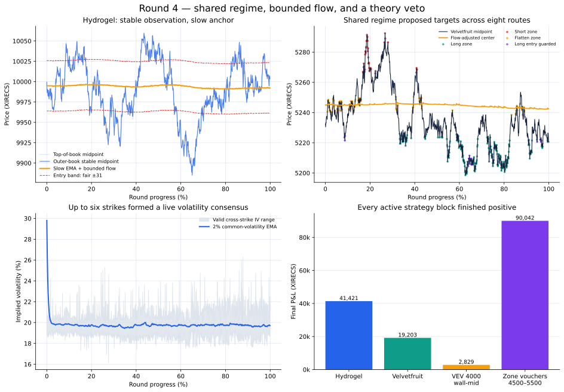
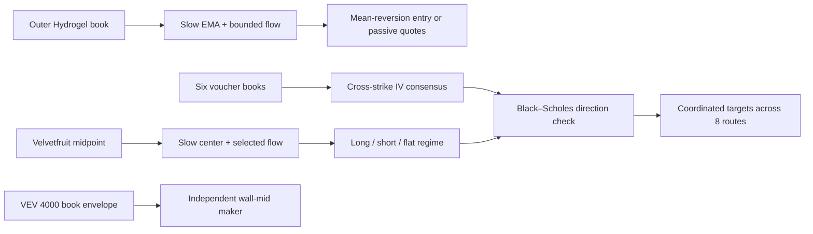

# Round 4 — shared regime, bounded flow, and a theory veto

[← Repository overview](../../README.md) · [Cleaned strategy](trader.py) · [Machine-readable result](summary.json) · [Full results](../../docs/results.md#round-4)

| Final score | Observed markets | Active routes | Positive active routes | Fill events | Filled units |
|---:|---:|---:|---:|---:|---:|
| **153,493.93** | 12 | 10 | **9 / 10** | 3,852 | 42,893 |



Round 4 was the point where most of the derivatives portfolio became one coordinated system. Instead of letting every voucher make an independent directional decision, I built a shared Velvetfruit regime, carried that regime across the underlying and seven strikes, and gave option theory the final right to reject an inconsistent direction. Hydrogel received its own two-layer execution engine, while `VEV_4000` retained a deliberately independent, passive wall-mid strategy.

The result was broad and substantial: Hydrogel earned **41,421.00**, Velvetfruit earned **19,202.56**, the zone-traded vouchers earned **90,041.51**, and `VEV_4000` earned **2,828.86 XIRECS**. All four strategy blocks were positive in aggregate, nine of ten individual active routes contributed positively, and the score was **4.55× Round 3**.

## The architectural change

Round 3 established the product universe and showed that vouchers needed strike-aware treatment. My Round 4 working hypothesis was that the next improvement would come from coordinating state, not from adding more independent predictors:

1. observe a less fragile price for Hydrogel;
2. keep valuation primary and let selected participant flow make only bounded adjustments;
3. express one Velvetfruit regime across the underlying and voucher family;
4. make trend and crash evidence asymmetric risk gates; and
5. use Black–Scholes as a consistency veto, not as a reason to trade by itself.



| Sleeve | State estimate | Decision layer | Execution |
|---|---|---|---|
| `HYDROGEL_PACK` | Outer-book midpoint, slow EMA, bounded Mark 38 fade | ±31 mean-reversion gate | 20-unit taker plus conditional two-sided maker |
| `VELVETFRUIT_EXTRACT` | Slow EMA and selected-flow adjustment | Shared long, short, flat, or wait regime | Move toward +200, −200, or zero |
| `VEV_4500`–`VEV_5500` | Shared Velvetfruit regime | Black–Scholes directional consistency check | Move toward +300, −300, or zero |
| `VEV_4000` | Visible book-envelope midpoint | Price versus wall midpoint | Sweep favorable levels, then quote both sides |
| `VEV_6000`, `VEV_6500` | Excluded from submitted active routing | No directional state | No orders |

## 1. Hydrogel — improve the observation before the model

### Why I changed the midpoint

The top of book can move because one small quote appears or disappears. For Hydrogel, I instead used the center of the visible book envelope:

$$
M_t^{stable}=\frac{\min(\text{visible bids})+\max(\text{visible asks})}{2}.
$$

In the supplied three-level export, this outer-book midpoint remained extremely close to the normal midpoint—0.57 ticks apart on average and 0.9997 correlated—but its mean absolute tick-to-tick change was **1.496 rather than 1.681 ticks**. That is a **10.98% reduction in short-horizon movement** without discarding the market's directional path.

This was an important design principle: reduce short-horizon movement in the observation first, then apply a simple model to the more stable series.

### Structural fair value

The base fair starts at 9,995 and deliberately moves much more slowly than the market:

$$
H_t=0.00005M_t^{stable}+0.99995H_{t-1}.
$$

Its half-life is approximately **13,863 observations**, longer than the 10,000-snapshot round. I treated it as a structural anchor rather than a short-term predictor.

Mark 38 flow makes a small contrarian adjustment. If $x_t$ is the decaying flow score,

$$
x_t=0.92x_{t-1}+
\begin{cases}
-q, & \text{Mark 38 buys }q,\\
+q, & \text{Mark 38 sells }q,
\end{cases}
$$

with $x_t$ clipped to ±30. The executable fair is

$$
H_t^*=H_t+0.10x_t,
$$

so flow can move valuation by at most three ticks. The tape contained 269 qualifying external Hydrogel trades and 1,068 units, yet the exported-state reconstruction's largest realized shift was only 1.09 ticks. The slow price anchor therefore remained in control.

### The mean-reversion evidence

For deviation $d_t=M_t^{stable}-H_t^*$, the strategy enters only when $|d_t|\geq31$. The post-run capsule shows descriptive reversion around that submitted threshold:

| Horizon after a ±31 observation | Mean movement toward fair | Observations moving toward fair |
|---:|---:|---:|
| 10,000 timestamp units | **5.91 ticks** | **61.13%** |
| 50,000 timestamp units | **22.16 ticks** | **79.68%** |

These are overlapping, descriptive post-run observations rather than a claim that every signal was independently tradable. They explain why the wide-entry, slow-anchor structure was well matched to this run.

### Two execution intentions

The directional layer is explicit:

- when $d_t\leq-31$, buy up to 20 units at the best ask;
- when $d_t\geq31$, sell up to 20 units at the best bid;
- close tracked aggressive long inventory when $d_t\geq0$;
- close tracked aggressive short inventory when $d_t\leq0$; and
- clip each order to the displayed best level and the ±200 limit.

I persisted separate `aggressive long` and `aggressive short` counters and reconciled them against observed net inventory on every call. These are execution-intent counters: they let the code remember why a directional order was sent while remaining robust to partial fills.

Only when both counters are zero does the passive layer activate. With $\bar M_{250}$ denoting the rolling mean of the last 250 stable midpoints and $p_t$ the current position, its quote center is

$$
Q_t=0.75M_t^{stable}+0.25\bar M_{250}-0.10p_t.
$$

The engine quotes `round(Q − 7)` and `round(Q + 7)`, at most 15 units on each side. This separates a wide, high-conviction reversion trade from routine spread capture while allowing both to share one inventory limit.

### Recorded Hydrogel outcome

| Metric | Result |
|---|---:|
| Final P&L | **41,421.00** |
| Completed flat-to-flat cycles | **3** |
| Profitable completed cycles | **3 / 3** |
| Fill events / units | 360 / 3,600 |
| Exported-book-classified aggressive / passive units | 3,286 / 314 |
| Buy volume / sell volume | 1,700 / 1,900 |
| Buy VWAP / sell VWAP separation | **23.69 ticks** |
| Recorded position range | −200 to +200 |

Hydrogel was the round's largest individual contributor. Its three completed inventory cycles were all profitable, and the final short inventory was fully included in the recorded mark-to-market result.

## 2. Velvetfruit — one shared directional state

### A slow center with bounded information

Velvetfruit uses the best midpoint $S_t$ and another structural EMA:

$$
E_t=0.00003S_t+0.99997E_{t-1}, \qquad E_0=5{,}245.
$$

Its half-life is approximately **23,105 observations**. The flow score then follows selected participants at different strengths:

$$
y_t=0.98y_{t-1}+\sum_j w_j\,\text{signed quantity}_{j,t},
$$

where $w_{67}=+1.50$ and $w_{14}=-0.30$. A Mark 67 buy raises the center and a sell lowers it; Mark 14 is lightly faded. The adjusted center is

$$
C_t=E_t+0.045y_t,
$$

with a hard ±5-tick cap on the flow adjustment.

The weights encode a stronger response to Mark 67 and a much smaller counter-signal for Mark 14. In the supplied external-trade records, Mark 67 appeared in 45 qualifying events and 392 units. Following that flow aligned with the next 1,000-timestamp-unit move in **64.44%** of observations, with a mean move of **1.52 ticks** in the indicated direction. The smaller Mark 14 weight kept the second input deliberately subordinate.

### The regime state machine

The code converts $S_t-C_t$ into four possible states:

| State | Condition | Velvetfruit target | Voucher target |
|---|---|---:|---:|
| Long | $S_t<C_t-20$ | +200 | +300 each |
| Short | $S_t>C_t+20$ normally; $S_t>C_t+40$ in an uptrend | −200 | −300 each |
| Flat | $C_t-5\leq S_t\leq C_t+5$ | 0 | 0 |
| Wait | Between the flat and entry bands | Keep current position | Keep current position |

The trend counter accumulates while the underlying is more than five ticks above its base EMA. Observations inside the ±5 band decay it one step toward zero, while a move below the lower band reverses it to a negative count. Once accumulated above-band evidence reaches 700, the short-entry distance widens from 20 to **40 ticks**. The asymmetry is intentional: the model still recognizes a rich market, but it demands more evidence before fighting a persistent upward trend.

A specific Mark 22 seller / Mark 49 buyer sequence sets a 200-count timer, which is decremented in the trigger call and then on each following call. While the remaining count is positive, only a proposed long entry is suppressed; flat, short, and wait behavior remains available. The exported market-trade tape contained six such triggers. This is best understood as a temporary long-entry guard rather than a general trading halt.

The exported-state replay classified the 10,000 snapshots as follows:

| Long | Short | Flat | Wait | Guarded long | Trend-widened band active |
|---:|---:|---:|---:|---:|---:|
| 2,571 | 424 | 1,310 | 5,424 | 271 | 877 |

Every active target mismatch is translated into one marketable limit order for the full gap between current position and target. This can repeat within the same regime after a partial fill. Actual execution remains bounded by the matching engine, while the next state reconciles the position from real fills.

### Recorded Velvetfruit outcome

| Metric | Result |
|---|---:|
| Final P&L | **19,202.56** |
| Completed flat-to-flat cycles | **8** |
| Profitable completed cycles | **8 / 8** |
| Fill events / units | 158 / 3,692 |
| Buy volume / sell volume | 1,946 / 1,746 |
| Buy/sell VWAP separation | **12.13 ticks** |
| Recorded position range | −200 to +200 |

The underlying was not merely a hedge in Round 4. It was a profitable directional sleeve and the state source that synchronized the voucher family.

## 3. Voucher family — empirical direction, theoretical veto

### Live cross-strike volatility consensus

The option layer uses a zero-rate European-call model:

$$
C(S,K,T,\sigma)=S\Phi(d_1)-K\Phi(d_2),
$$

where

$$
d_1=\frac{\ln(S/K)+\tfrac12\sigma^2T}{\sigma\sqrt T},
\qquad
d_2=d_1-\sigma\sqrt T.
$$

At every snapshot, the code:

1. takes the top midpoint of `VEV_5000` through `VEV_5500`;
2. solves each valid implied volatility with at most 20 Newton steps, starting from 30%;
3. rejects invalid or numerically unstable estimates;
4. retains estimates between 5% and 200% and averages them equally; and
5. updates a common volatility state with a 2% EMA.

The solver accepts convergence once model error is below 0.5 tick. It rejects prices at or below intrinsic value plus 0.5, prices at or above spot, and iterations with vanishing vega.

This is a **cross-strike implied-volatility consensus**, not a fitted polynomial surface. Time to expiry declines linearly from $4/252$ to $3/252$ through the round, so the theoretical check also reflects theta.

| Volatility diagnostic | Exported-state result |
|---|---:|
| Initial state | 30.00% |
| First updated state | 29.80% |
| Final state | **19.72%** |
| Post-update smoothed range | 19.44%–29.80% |
| Mean valid strikes per snapshot | **5.25 / 6** |
| Snapshots with at least one valid IV | **10,000 / 10,000** |
| Mean cross-strike IV dispersion, when at least two estimates are valid | **0.81 volatility points** |

The low dispersion supports using one smoothed family-level volatility as a practical consistency variable for this submission.

### Black–Scholes as a directional gate

The zone model proposes direction; theory decides whether that direction is acceptable. For voucher midpoint $V_{i,t}$, define

$$
r_{i,t}=V_{i,t}-C(S_t,K_i,T_t,\sigma_t).
$$

- reject a proposed long when $r_{i,t}>3$ because the voucher is already rich;
- reject a proposed short when $r_{i,t}<-3$ because the voucher is already cheap; and
- never open the opposite trade from this calculation alone.

Across the exported reconstruction, the zone direction and theoretical value agreed overwhelmingly. Only 25 of 20,965 directional product-snapshot checks crossed the three-tick veto, and only two of those coincided with an actual gap to the desired position. Twenty-four of the 25 checks occurred in deep-in-the-money `VEV_4500`; only one appeared across the six strikes used to form the volatility consensus.

That is exactly the role I wanted from the model: a cheap family-level safety check that stayed out of the way when the empirical regime and the cross-strike valuation already agreed.

### Voucher outcome

| Voucher block | Final P&L | Fill events / units | Closed-cycle evidence |
|---|---:|---:|---:|
| `VEV_4500`–`VEV_5500` | **90,041.51** | 3,171 / 35,264 | 50 completed cycles |
| `VEV_5000`–`VEV_5300` | **84,372.36** | 1,762 / 20,694 | **29 / 29 profitable** |
| All active vouchers, including `VEV_4000` | **92,870.37** | 3,334 / 35,601 | 63 completed cycles |

The strongest middle-strike block converted the shared regime into **84,372.36 XIRECS** and completed every one of its 29 closed inventory cycles profitably. The complete zone voucher family remained strongly positive.

## 4. `VEV_4000` — keep the reliable passive engine

`VEV_4000` is routed outside the zone system. Its fair is the visible book-envelope midpoint:

$$
W_t=\frac{\min(\text{visible bids})+\max(\text{visible asks})}{2}.
$$

The engine first takes any displayed ask below $W_t$ or bid above $W_t$. At the midpoint it trades only to reduce an opposing inventory. It then posts one bid below fair and one ask above fair, improving an eligible visible level by one tick when its displayed size is greater than one. Remaining quote capacity is calculated against the ±300 limit.

| Metric | Result |
|---|---:|
| Final P&L | **2,828.86** |
| Fill events / units | 163 / 337 |
| Exported-book-classified passive share | **100%** |
| Completed profitable cycles | **13 / 13** |
| Mean absolute position | 5.79 units |
| Recorded position range | −17 to +13 |
| Buy/sell VWAP separation | **16.45 ticks** |

This was a compact, capital-efficient sleeve: all 337 recorded units classified as passive against the same-timestamp exported top of book, inventory stayed tiny relative to the available limit, and all thirteen completed cycles were profitable.

## Portfolio result

| Strategy block | Final contribution | Share of final score |
|---|---:|---:|
| Hydrogel dual-layer engine | **41,421.00** | 27.0% |
| Velvetfruit shared-regime engine | **19,202.56** | 12.5% |
| `VEV_4000` wall-mid maker | **2,828.86** | 1.8% |
| Zone vouchers, `VEV_4500`–`VEV_5500` | **90,041.51** | 58.7% |
| **Total** | **153,493.93** | **100%** |

The result was both large and distributed:

- **9 of 10** active markets were profitable;
- gross winning sleeves contributed **155,000.23 XIRECS**;
- the single small residual loss was less than 1% of gross winning contribution;
- the eight principal sleeves—Hydrogel, Velvetfruit, `VEV_4000`, and `VEV_4500`–`VEV_5300`—completed **58 / 58 profitable flat-to-flat cycles**;
- eight of the ten 100,000-timestamp intervals added P&L;
- aggregate product P&L remained positive at every recorded activity snapshot after timestamp 300,000; and
- the final score retained **92.64%** of the sampled peak.

Relative to Round 3's 33,767.52, Round 4 added **119,726.41 XIRECS**, a **354.56% increase**. The comparison does not isolate one parameter's causal effect, but it is consistent with the architectural decision to coordinate the family around a shared regime and layered confirmation.

## What I believe made the strategy strong

1. **The observations matched the market structure.** Hydrogel used a stable book-envelope center; Velvetfruit used its liquid top midpoint; the deep voucher retained its own wall-mid engine.
2. **Valuation remained primary.** Participant information could adjust Hydrogel by three ticks and Velvetfruit by five, never replace the slow anchors.
3. **One regime created coherent exposure.** The underlying and seven vouchers moved from the same state rather than producing contradictory independent directions.
4. **Risk gates were asymmetric.** A sustained uptrend raised the evidence required to short, while a specific flow event temporarily blocked only new longs.
5. **Theory had a narrow, useful job.** Black–Scholes could veto an inconsistent voucher direction but could not manufacture a trade without an empirical zone signal.
6. **Intent survived partial fills.** Hydrogel's persisted directional counters were reconciled against real inventory before the passive engine was allowed to quote.

## Reproducible capsule audit

The dedicated analyzer processes the exact supplied result export and runs the cleaned strategy over reconstructed exported states at all 10,000 timestamps:

```bash
python scripts/analyze_round_four.py
```

It verifies:

- 120,000 activity rows across 12 markets and 10,000 timestamps;
- **3,852 recorded fill events and 42,893 filled units**;
- product P&L sums exactly to the final score;
- fill-derived ending positions match the capsule;
- every recorded position remained within its configured limit;
- the strategy returned outputs for all 10,000 exported states with no uncaught replay exception;
- every returned price was an integer;
- conversions remained zero; and
- `VEV_6000` and `VEV_6500` correctly returned no orders.

The raw export retains up to three book levels and a merged trade history, not the matching engine's complete private runtime state. I therefore treat this as an **exported-state reconstruction**, not a replacement backtest. Under the stated same-timestamp, non-submission trade routing, 2,722 complete fill events and 29,461 units matched an order at the same side and price; the independent `VEV_4000` route matched all 163 fills. These are match-coverage diagnostics under the reconstruction, not proof of causal order lineage. Tape-derived P&L, fills, and ending positions remain the authoritative outcome measures.

During development I used [Jmerle's Prosperity 3 backtester](https://github.com/jmerle/imc-prosperity-3-backtester) and [visualizer](https://github.com/jmerle/imc-prosperity-3-visualizer) to shorten the experiment loop. The supplied live capsule is used here for the final evidence because local replay cannot recreate every competitor, queue position, or matching-engine detail.

## Round 4 takeaway

Round 4's main lesson was not that a more complicated pricing formula automatically wins. It was that **one clean state can coordinate many related markets when every added input has a bounded role**. Stable observation created the anchor, selected flow refined it, the regime supplied direction, option theory checked consistency, and execution state translated the idea into controlled inventory. That hierarchy produced the strongest result of the first four rounds and became the foundation for scaling to many product families in Round 5.
