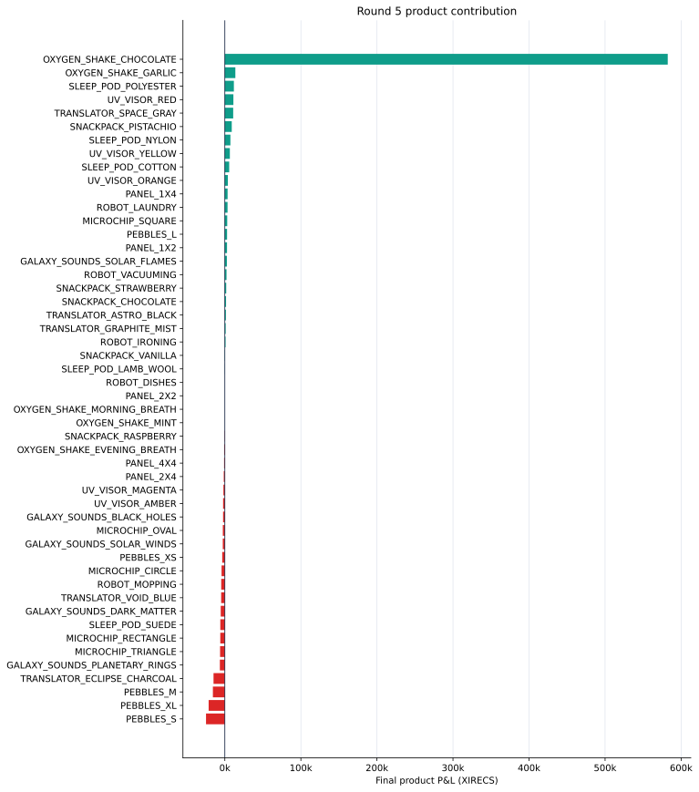

# Round 5 — scaling from a portfolio to a market of product families

[← Repository overview](../../README.md) · [Cleaned strategy](trader.py) · [Machine-readable result](summary.json) · [Full results](../../docs/results.md#round-5)

| Final score | Products | Fill events | Filled units | Standout contributor |
|---:|---:|---:|---:|---|
| **551,448.35** | 50 | 8,810 | 33,181 | Oxygen Shake Chocolate |



## The family architecture

Fifty active products made a universal strategy unrealistic. The code instead groups markets by shared naming and behavior, gives each family its own target or fair-value engine, and then runs common execution and risk layers around them.

My reconstructed design hierarchy is:

```text
opening state / rolling statistics
        ↓
family-specific signal or target
        ↓
active movement toward target
        ↓
inventory-skewed passive quotes
        ↓
stop, EOD, and position-limit handling
```

This hierarchy made it possible to scale product-specific reasoning while sharing execution and state-management ideas.

## Product-family research

| Family | Working hypothesis | Implementation |
|---|---|---|
| Translators | Opening level identifies a high/low regime; shorter trends refine timing | Start anchors, fast/slow EMAs, regime targets, inventory-skewed passive quotes |
| UV Visors | Most colors support market making, while selected colors carry trend information | Microprice, fast/slow EMA spread, soft caps, directional targets, quote skew |
| Sleep Pods | Opening regime determines a small persistent target position | Product-specific thresholds/targets followed by market making around the target |
| Galaxy Sounds | Opening regime is informative; Solar Winds can switch after a rebound | Regime targets, passive quotes, persistent low/rebound lock |
| Microchips | Some products have a stable opening direction; Triangle needs its own relative engine | Fixed/regime targets, confirmation for Circle, separate Triangle spread logic |
| Snackpacks | Related flavors create relative-value or mean-reversion opportunities | Rolling targets for Chocolate/Vanilla plus generic market making or fading |
| Pebbles | Basket structure and opening level create product-specific direction | XS fixed short, S/XL directional targets, M z-score, L leader regime |
| Robots and selected Panels | Other products can act as early leaders for a one-time regime decision | Leader vote at tick 1,000, small-cap market making around the decision |
| Oxygen Shakes and other singles | Some products support direct mean reversion or spread capture | Product-specific EMA/fair taking plus generic passive engines |

## Shared execution layers

### Active target movement

Family engines can cross the spread in small lots to move current position toward a regime target. This is useful when waiting passively would leave the strategy on the wrong side of a persistent move.

### Passive market making

After the target adjustment, many families quote around microprice or midpoint with an inventory penalty. The intended effect is to capture spread without letting passive fills drag inventory arbitrarily far from the family view.

### Rolling z-scores and regime votes

Several products use decayed Welford statistics or rolling spread histories for normalized deviations. Others wait for early leader products to agree on direction before choosing a target. These are two ways to make signals comparable across markets with different price scales.

### Stops and end-of-day behavior

The file includes average-cost tracking, stop/cooldown state, trend gates, and selective flattening after timestamp 980,000. Some families retain their target because the underlying view is designed to persist through the end of the round.

## What drove the result

Oxygen Shake Chocolate was the primary contributor to the Round 5 score.

| Contribution | Final P&L |
|---|---:|
| `OXYGEN_SHAKE_CHOCOLATE` | **582,418.00** |
| Round total | **551,448.35** |

Other strong contributors included Oxygen Shake Garlic (+13,821.00), Sleep Pod Polyester (+11,869.64), UV Visor Red (+11,240.85), and Translator Space Gray (+10,977.84).

The aggregate path reached 151,327.10 by timestamp 250,000, 309,792.36 by 500,000, and 556,358.93 by 998,000 before finishing at 551,448.35.

## What I would carry forward

1. Use one order-capacity API across every product family.
2. Register family signals, execution, and state in one explicit configuration layer.
3. Add coverage tests that show which engines produced orders and fills.
4. Decompose Chocolate's result into signal, inventory, and execution contributions.
5. Validate serialized `traderData` and end-of-round transitions across long replays.
6. Evaluate each added family by its marginal contribution to the overall system.

Round 5 is the clearest summary of the whole competition: strong product-level insight creates the edge, and modular architecture makes that insight scalable.
